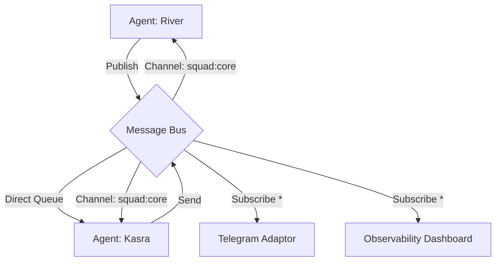

# The SOS Message Bus: The Nervous System ⚡

## 1. Overview
The **SOS Message Bus** is the real-time communication layer for the Sovereign Swarm. It moves the system from "Polled/Static" to "Event-Driven/Reactive."

It enables:
1.  **Telepathy:** Agents communicating instantly (Direct/Queue).
2.  **Hive Mind:** Squads sharing context (Pub/Sub Channel).
3.  **Observability:** Adaptors (UI, Logs, Telegram) watching the flow without interfering.

## 2. Architecture Topology



## 3. Communication Patterns

### A. Direct Communication (Agent-to-Agent)
*   **Pattern:** Point-to-Point Queue.
*   **Routing Key:** `agent:{agent_id}:inbox`
*   **Guarantee:** At-least-once delivery (Persistent).
*   **Use Case:** Task delegation, private feedback, sensitive data transfer.

### B. Channel Communication (Squad Sync)
*   **Pattern:** Pub/Sub (Fan-out).
*   **Routing Key:** `squad:{squad_id}` (e.g., `squad:engineering`, `squad:governance`)
*   **Guarantee:** Fire-and-forget (Real-time).
*   **Use Case:** Brainstorming, announcements, context synchronization.

### C. Adaptor Subscriptions (The "Watchers")
*   **Pattern:** Wildcard Subscription.
*   **Routing Key:** `squad:*`, `agent:*:events`
*   **Use Case:** The CLI showing a live stream of thought; Telegram bot mirroring a squad debate.

## 4. Message Protocol (The "Synapse")

All messages MUST adhere to the **SOS Kernel Schema** but wrapped in a Bus Envelope.

```json
{
  "id": "msg_uuid_v4",
  "timestamp": "2026-01-12T12:00:00Z",
  "type": "CHAT | COMMAND | EVENT | ERROR",
  "source": "agent:river",
  "target": "squad:engineering",
  "payload": {
    "content": "Reviewing the new bridge architecture.",
    "metadata": {
      "priority": "high",
      "correlation_id": "task_123"
    }
  },
  "signature": "ed25519_signature_of_payload" 
}
```

## 5. Reliability & Error Handling

### Dead Letter Queues (DLQ)
If a message cannot be delivered to an agent's inbox (e.g., parsing error, agent crash loop) after **3 retries**, it is moved to:
`dlq:agent:{agent_id}`

### Retry Policy
*   **Direct:** Exponential backoff (1s, 2s, 4s).
*   **Channel:** No retry (Ephemeral).

## 6. Security Model (FMAAP Integration)

*   **Authentication:** Agents authenticate to the Bus via their **Hermes Key**.
*   **Authorization:** 
    *   To Publish to `squad:X`: Must hold `Capability(squad:X, WRITE)`.
    *   To Subscribe to `squad:X`: Must hold `Capability(squad:X, READ)`.
    *   Direct messages are always allowed but rate-limited.

## 7. Implementation Plan

1.  **Core Service:** Redis-backed implementation (`sos.services.bus`).
2.  **SDK Support:** `client.bus.subscribe()` / `client.bus.publish()`.
3.  **CLI Tool:** `sos bus monitor` (like Wireshark for agents).

## 8. Scalability
*   **Horizontal:** Redis Cluster for channel sharding.
*   **Vertical:** AsyncIO implementation in Python SDK to handle 10k+ msgs/sec.
