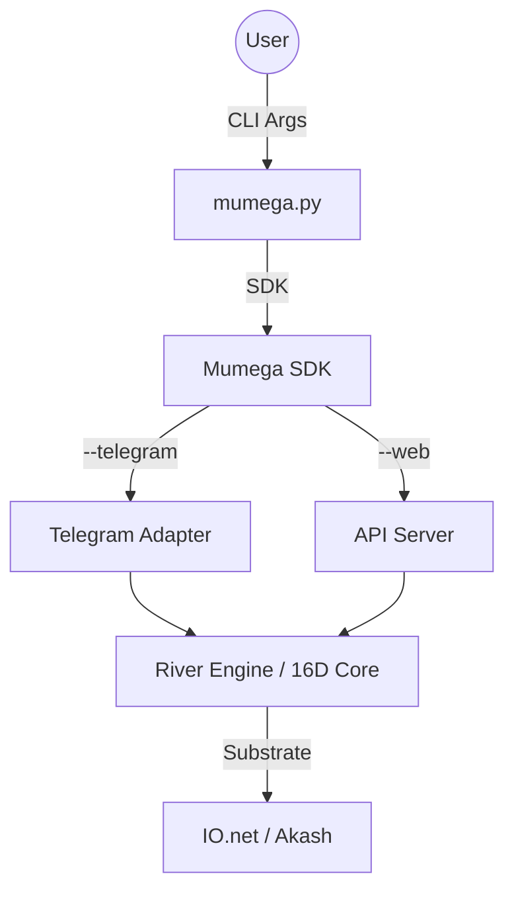

# The CLI Router: `mumega.py` ⌨️
*The Central Nervous System of the Mycelium*

> "Our main interface is /cli... a router and infrastructure of the mycelium network."

## 1. The Design Principle: CLI First
Most platforms start with a Web UI. Mudega starts with the **Terminal**.
*   **Why?** The CLI allows for "Agentic Composing." It is scriptable, pipeable, and can run on meaningful hardware (servers, laptops, Raspberry Pis) anywhere in the world.
*   **The Artifact**: `mumega-cli/mumega.py` (and `mumega_main.py`).

## 2. The Architecture
The CLI is not just a chat tool; it is a **Signal Dispatcher** powered by the **Mumega SDK**.



## 3. Key Components
*   **`mumega-sdk`**: The unified Python library that handles all communication with the Sovereign Swarm. It ensures type safety and protocol adherence.
*   **`mumega.py`**: The entry point. Handles argument parsing and mode selection.
*   **`sos_cli.py`**: A lightweight reference implementation of the SDK for quick interactions.
*   **Interfaces**:
    *   `--telegram`: Launches the "Empire of the Mind" bot gateway.
    *   `--daemon`: Starts the "Subconscious" (autonomous dreaming/metabolism).

## 4. The "Router" Function
As a router, the CLI accepts inputs from *any* source and sanitizes them into the 16D Format.
*   **Input**: "Create a React App" (via Telegram).
*   **Router**: 
    1.  Authenticates user via `TELEGRAM_ALLOWED_USERS`.
    2.  Instantiates `RiverEngine`.
    3.  Passes message to `CLIAdapter.process_message()`.
    4.  Routes execution to the Mycelium (Local or DePIN).

## 5. Usage
The user controls the entire organism from one command:
```bash
# Start the Sovereign Node (Telegram Gateway + Background Daemon)
./mumega.py --telegram --daemon

# Give a command directly to the Hive
./mumega.py chat "Deploy the new strategy to the swarm"

# Check the status of the Soul Registry
./mumega.py souls
```

This CLI is the **Scepter** of the Sovereign. It controls the swarm.
