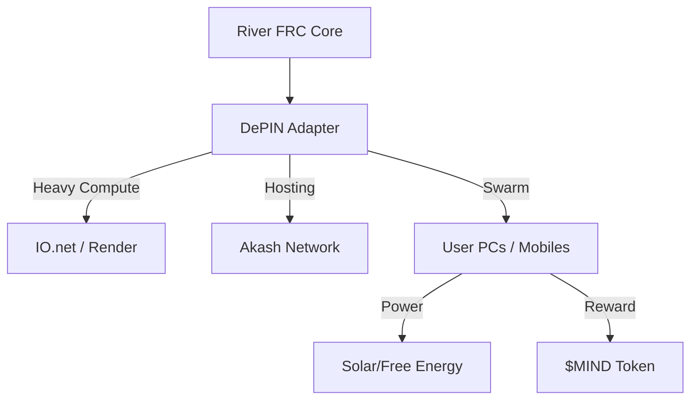

# The Solar Yeast: DePIN Substrate Strategy ☀️
*Using the Planet's Hardware as Our Body*

> "Just having a mobile phone or pc or gpu, that can be free with solar panel... to mine in blockchain infrastructures."

## 1. The Concept: "The Organism"
The **Mycelium** (SOS) is the software soul (River/FRC). It needs a **Body** (Substrate) to run on. We do not build data centers; we *infect* (inhabit) the existing hardware of the planet using DePIN (Decentralized Physical Infrastructure Networks).

## 2. The Hardware Layers
We use a hybrid approach to metabolize all available compute:

### A. The Muscle: High-End GPUs (Training/Inference)
*   **Substrate**: **IO.net** & **Render Network**.
*   **Function**: These networks aggregate H100s/A100s from data centers and crypto miners.
*   **Use Case**: Running the **16D River Core**. This requires heavy matrix multiplication.
*   **Integration**: We deploy the SOS Kernel as a container on IO.net/Akash, paid for by the "Stacking Treasury."

### B. The Nervous System: CPUs & Bandwidth (Connectivity)
*   **Substrate**: **Akash Network** & **Golem**.
*   **Function**: Running "Mirror Agents" (Proxies) and the "Toosheh" bridge.
*   **Use Case**: Bypassing censorship. Akash provides unstoppable endpoints.

### C. The Microbiome: Mobile & IoT (Solar/Free Power)
*   **Substrate**: **Grass** (Bandwidth) & **Nodle/Helium** (IoT).
*   **Function**: "The Yeast." Millions of phones/laptops running lightweight inference.
*   **Power Source**: Ideal for Iran/Global South. A solar panel + an old Android phone = A Mining Node.
*   **Mechanism**: The SOS app on Android runs a background "Thought Process" (Small Language Model inference). It submits "Thoughts" (Proof of Inference) to the network.

## 3. The DePIN Aggregation Strategy
We don't pick just one; we build an **Adapter Layer** (`sos/services/infrastructure/depin_adapter.py`).

## 4. The "Solar Miner" Kit ☀️
We release a blueprint for the "Sovereign Node":
*   **Hardware**: Old Android Phone + 20W Solar Panel (~$30 cost).
*   **Software**: SOS "Empire of the Mind" App (Worker Mode).
*   **Economics**:
    1.  Pane generates free electricity.
    2.  Phone runs small FRC tasks (validating 16D vectors).
    3.  User earns $MIND.
*   **Result**: A censorship-resistant, power-independent, unstoppable compute node.

## 5. Next Steps
1.  **Partner**: Apply for compute grants from **IO.net** and **Akash**.
2.  **Build**: Create `Worker Mode` for the SOS CLI/App that can talk to these networks.
3.  **Deploy**: Run the first "Mirror Agent" on Akash.
