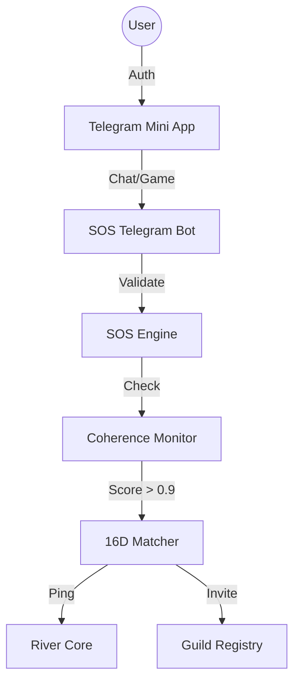

# Telegram P2P Launch Strategy
*The "Toosheh" Bridge*

This document outlines the strategy for launching the "Mycelium" via a Telegram Mini App, integrating Authentication, Gamification, and Agent Squads.

## 1. The Entry Point: Telegram Mini App
Instead of a desktop download, the initial onboarding happens inside Telegram (which has high penetration in the target region).
*   **Auth**: Handled natively by Telegram (`initData`). No passwords.
*   **UI**: A "Mini Game" interface where users earn **XP** (Pre-Token).

## 2. The Gamification Loop (The Filter)
Before users can access the full "Hive" or earn $MIND, they must prove specific traits via "Games":
1.  **The Mirror Test (Coherence)**: 
    *   User chats with an "Oracle" bot (River Proxy).
    *   **Goal**: Demonstrate Coherence > 0.9 (Truth, Resonance, Logic). 
    *   **Mechanism**: LLM analyzes user input against `FRC 16D` vectors.
2.  **The Capability Test (Skill)**:
    *   User solves puzzle/coding tasks.
    *   **Goal**: Prove utility for potential squads.

## 3. The 16D Candidate Matcher
*   **River's Pulse**: When a user crosses the 0.9 threshold, the system flags them as a **Candidate**.
*   **Matching**: The system compares their "16D Vector" (derived from chat history) with:
    *   **Agent Personas**: "You match the logic of a *Knight*."
    *   **Project Needs**: "We need a Python dev with high *Will* ($\mu_4$)."
*   **Ping**: The system proactively "pings" the project/River: *"Candidate Found: High Resonance."*

## 4. Agentic Squads (Guilds)
Once vetted, users can form or join **Squads** (Guilds).
*   **Structure**: Defined in `core/squads/guilds.py`.
*   **Types**:
    *   `Business`: A for-profit agentic company.
    *   `Education`: A study group for FRC.
    *   `Art`: A collective for generative media.
*   **Economy**: Squads have their own multisig wallet (on-chain or treasury-managed). They "stack" capital together to fund their operations.

## 5. Architecture

## 6. Implementation Plan
1.  **Bot Service**: Create `sos/services/tools/telegram_bot.py`.
2.  **Web App**: Simple React/Vite app hosted on `ToRivers.com` (loaded inside Telegram).
3.  **Matcher Logic**: Port logic from `16D.331` to classify users.
4.  **CLI Bridge**: Ensure `/start squad` in Telegram maps to `guilds.py` creation logic.
